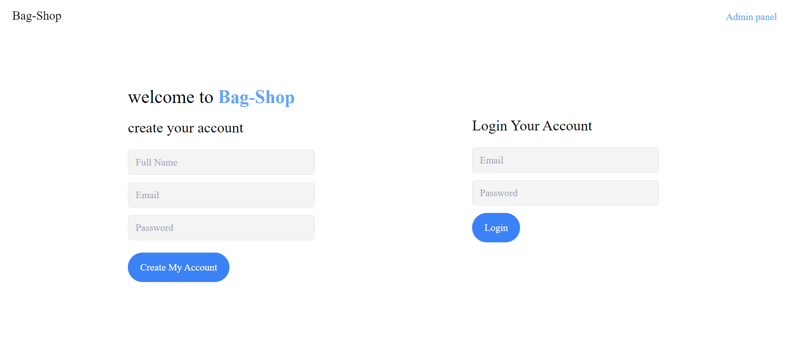
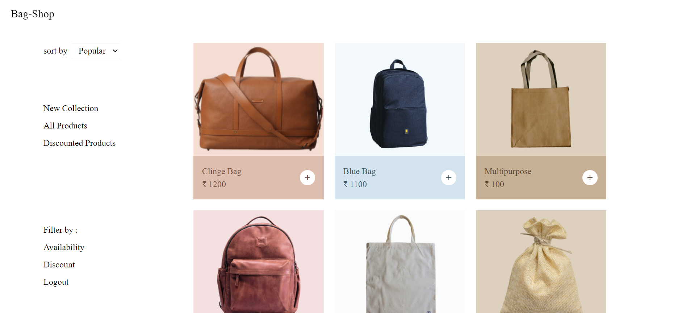
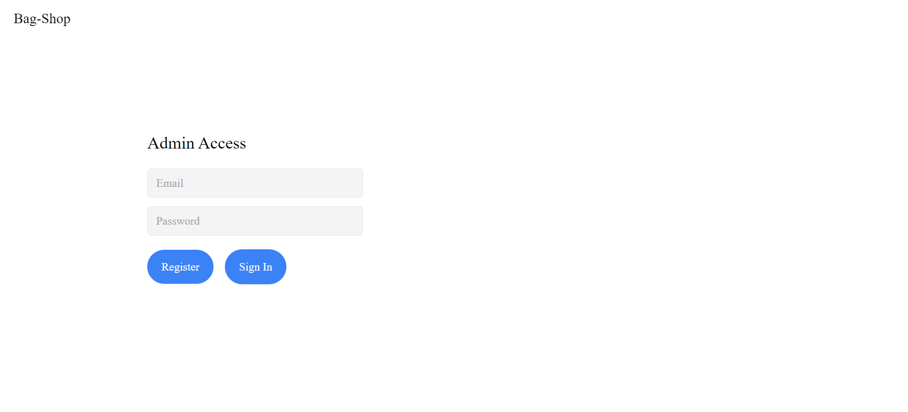
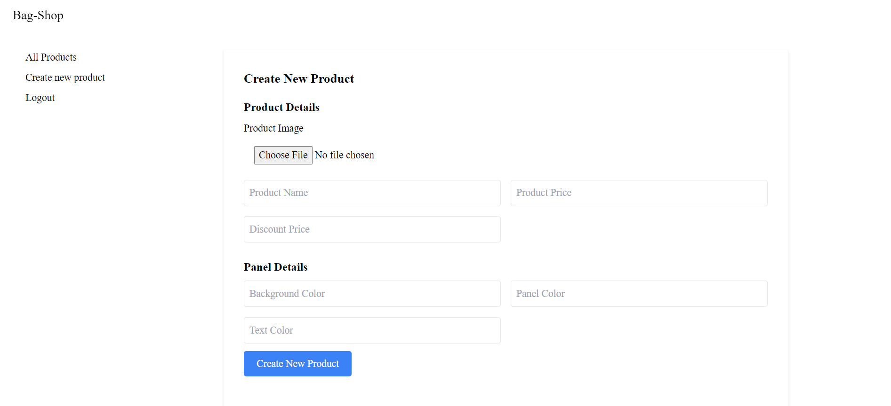

## How to setup the project?

Step 1: run
```
npm i
```

Step 2: make a .env file to include
```
JWT_KEY=anyvalue
EXPRESS_SESSION_SECRET=anyvalue
MONGODB_URI=URL
```

Step 3: run

```
nodemon app.js
```


Additional Information:
    
    - There can be only one admin.
    - After you log in as a Admin using admin panel.
    - You can use images from public folder to create the products.
    - You need to provide background color,     panel color and text color during form submission. so some of the color combinations are given below. You can use it:

        Brown Bag
            text 774F3D
            panel DEBEAE
            bgcolor F4DDD2

        Lightblue Bag
            text 40606E
            panel D3E4EE
            bgcolor F3F8FB

        Light brown Bag
            text 5F4A30
            panel C5B095
            bgcolor DED0BF

        Pink Bag
            text 816264
            panel E3C4C6
            bgcolor F4E0E1

        White Bag
            text 717171
            panel EBEBEB
            bgcolor FBFBFB

Preview of the website:

Home Page


User panel


Admin panel


Create Product Page

